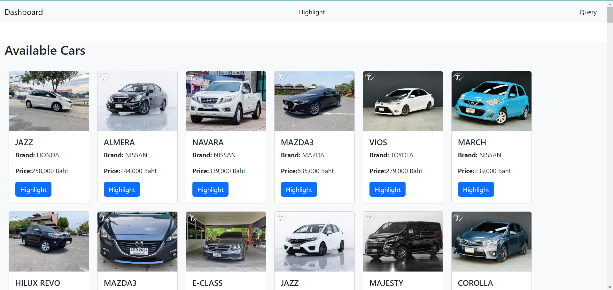

# Page Discription

Car Cards are show on the dashboard page and on the navigation bar there are two buttons for the querry and the hightligt  

when u click the highlight buttons from the car card the cars will appear on the higlight page 

In the query page is the number of cars in the brand and uder that brand is the total numbers of cars according to the models

and in the highlight page the cars from the dashboard page will apear when u click the highlight button

